# Dog Date

## Demo and API
[Live Demo](https://dog-date-app.herokuapp.com/)
[API](https://github.com/lkarper/dog-date-api)

## Summary
Dog Date is a web app for users who want to find playmates for their dogs. Whether you have one or one-hundred dogs, you can create profiles for them on Dog Date. You can set a profile picture for your dog, characterize its energy-levels, obedience, experience with other dogs, and more! This allows others to decide if your dog is the right playmate for their dog! Other users can leave reviews of your dog(s) and their dates, and then you can comment on those reviews in response.

## What can Dog Date do?

### Howl about your dog and see what others are howling about!
On Dog Date, you find playmates for your dog by [creating](https://dog-date-app.herokuapp.com/create-howl) and [viewing](https://dog-date-app.herokuapp.com/howls) "Howls". 

Create a howl:
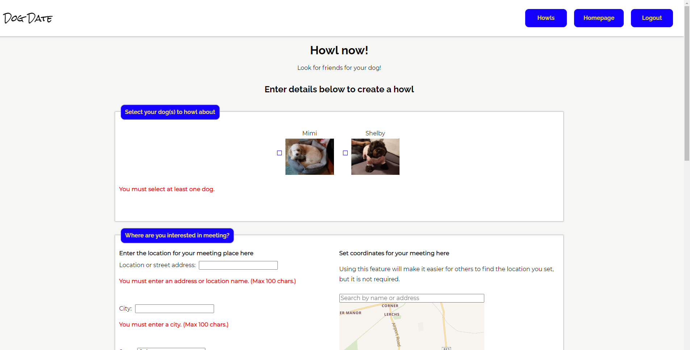

A typical howl:
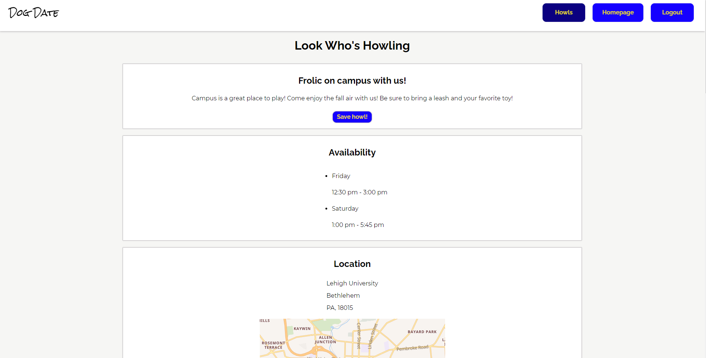
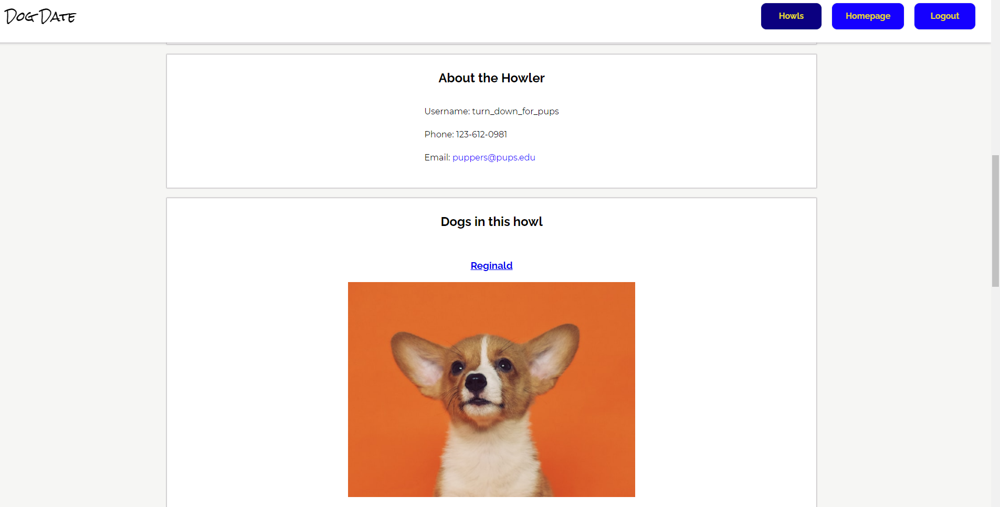
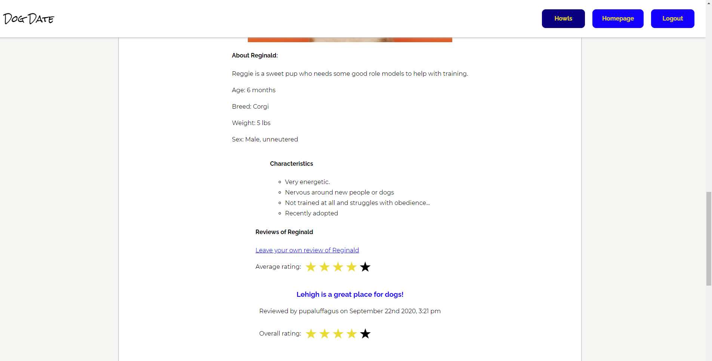

Howls are essentially a message from a user that he or she is looking for playmates for his or her canine companion(s)! There are two types of Howls: "one-time" and "recurring" playdates. "One-time" playdates are requests for a playdate on a specific date. Users post a date, available time frames, and a proposed location, and then wait for other interested users to contact them. "Recurring" Howls, on the other hand, let users know that a user is generally available at certain times for a playdate (e.g. Saturdays from 11:00 am - 4:00 pm).

On the Howls page users can filter howls by zipcode, state, or the average rating of dogs in the Howl (more on ratings below.)

Note: At the moment, all of the Howls are demo requests and do not actually represent real-world dogs and users.

### Create profiles for your dog!
Whether you have one or one-hundred dogs, you can [create profiles](https://dog-date-app.herokuapp.com/create-dog-profile) for them on Dog Date. You can set a profile picture for your dog, characterize its energy-levels, obedience, experience with other dogs, and more! This allows others to decide if your dog is the right playmate for their dog!

A typical dog profile:
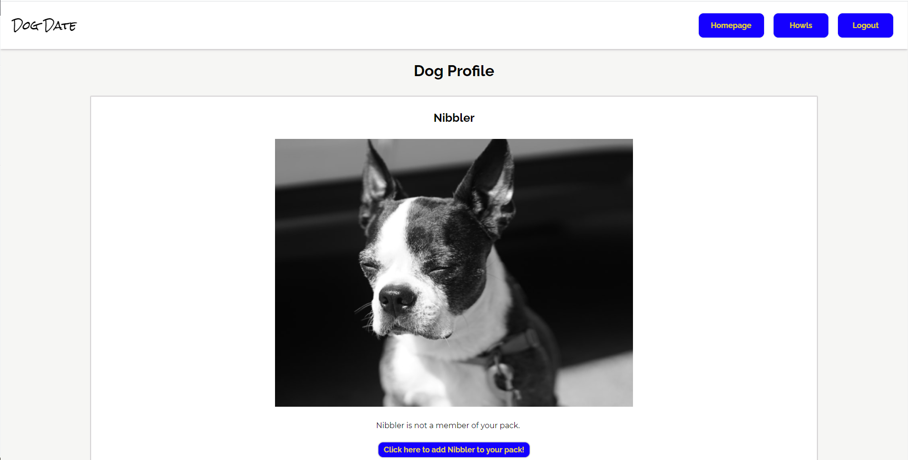
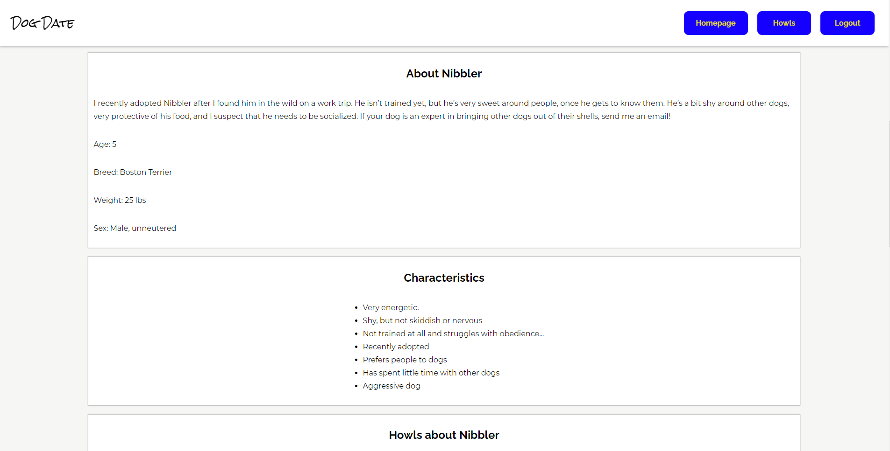
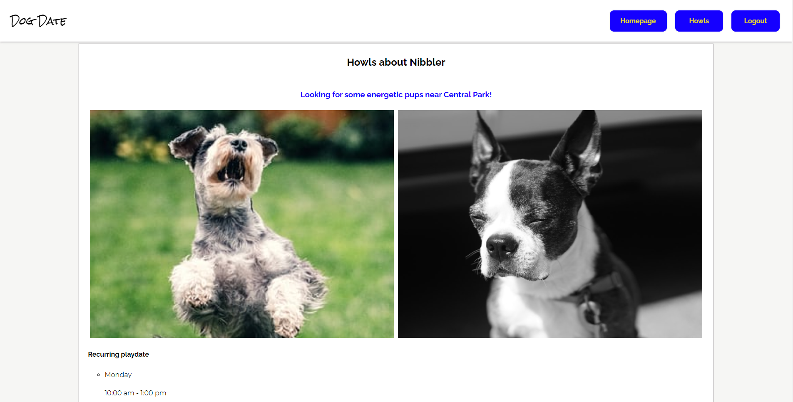
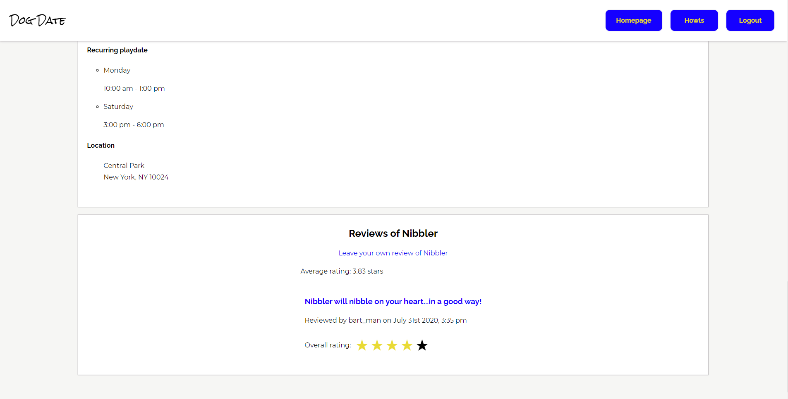

A typical dog review:
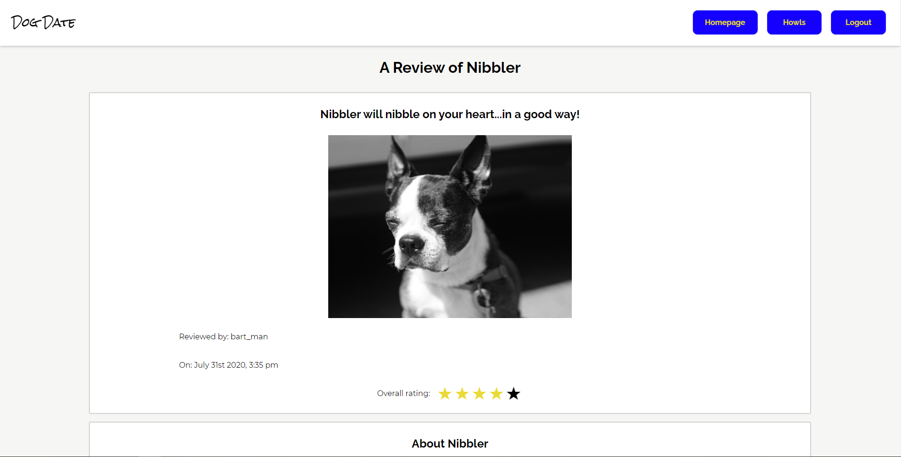
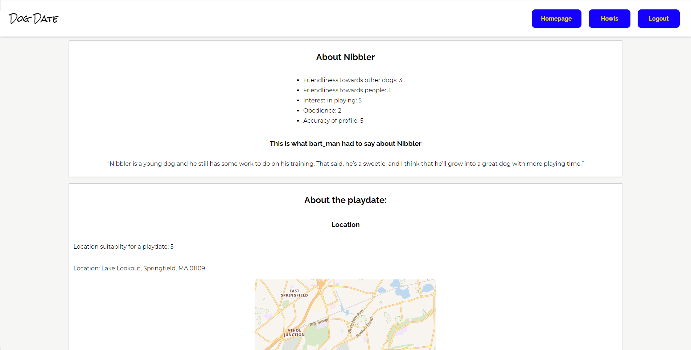
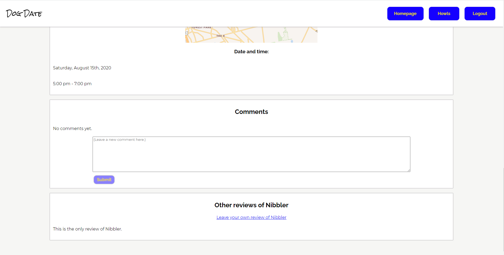

Other users can leave reviews of your dog(s) and their dates, and then you can comment on those reviews in response.

### View the profiles of other users' dogs!
You can also view profiles of other users' dogs and even save those profiles by adding them to your pack! A dog's profile page not only gives you a description and photo of a user's dog, but it likewise gives you a handy list of Howls about that dog and reviews of that dog by other users. This allows you quickly to see when and where that dog is available to play and to decide if that dog is the right dog date for your pooch!

### Keep track of everything on your dashboard!
Once you have an account, your dashboard keeps track of your dogs, howls, and members of your pack!

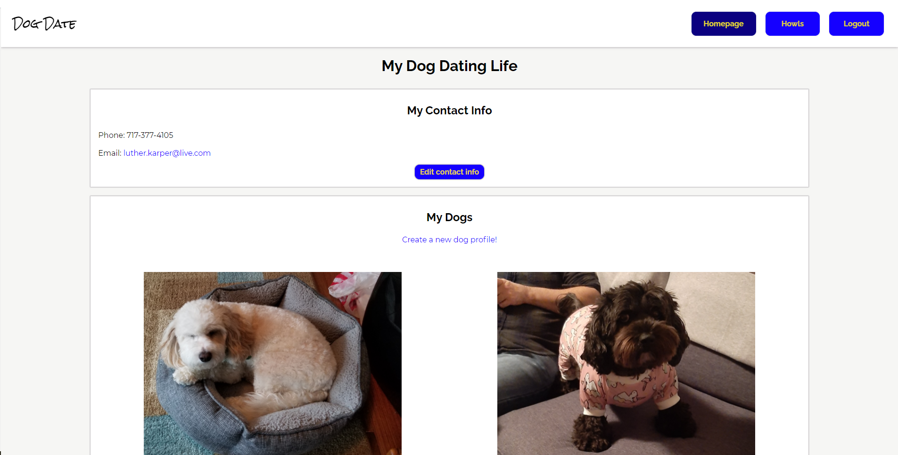
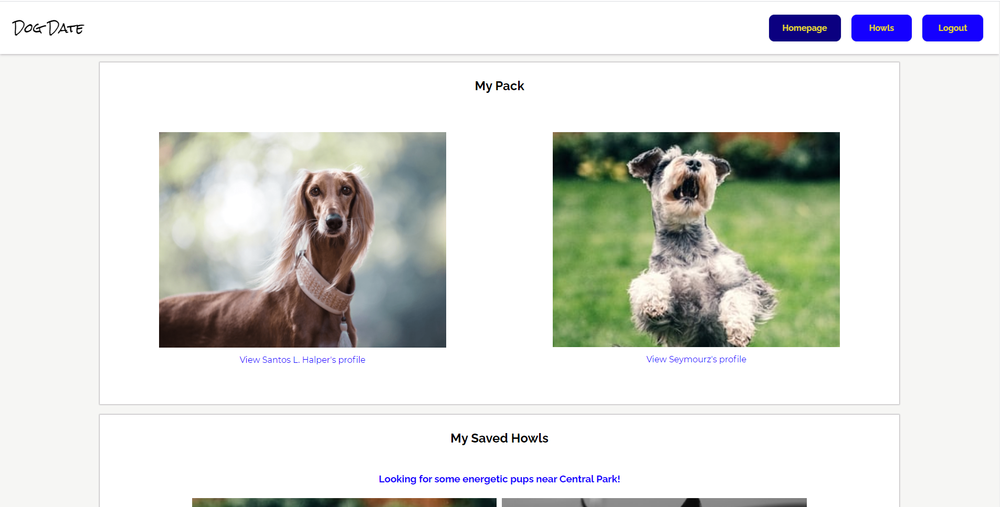
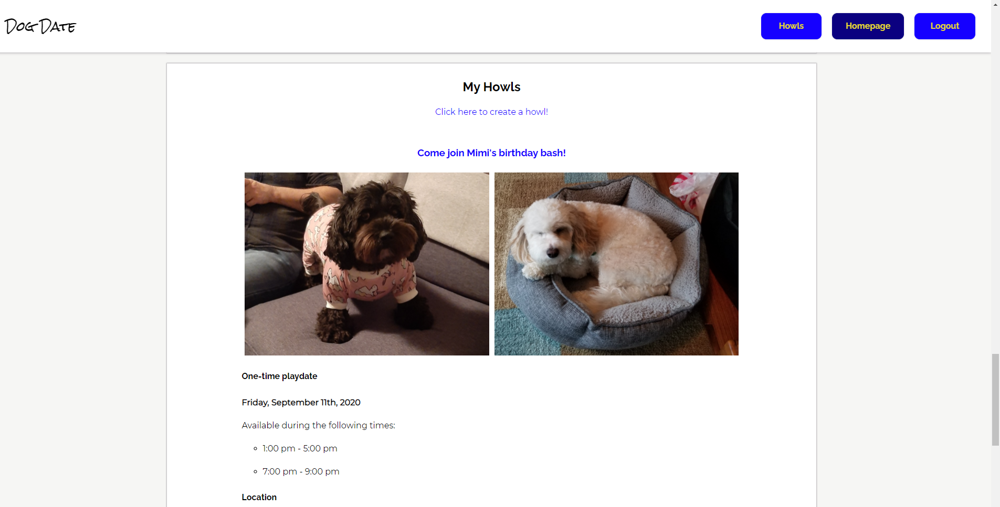
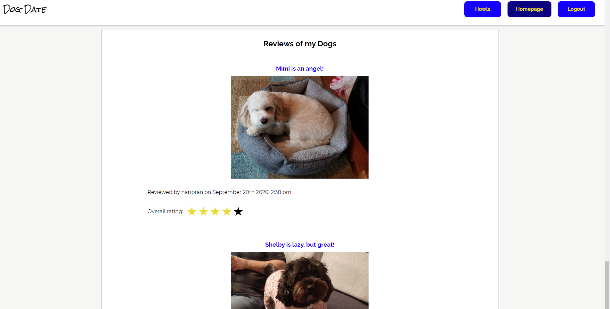

## Get Started
Get started by [registering](https://dog-date-app.herokuapp.com/register) for an account!

## Created With
* React
* Node.js
* HTML
* CSS/SCSS
* JavaScript
